# validata-benchmarks

Steady-state **in-memory** benchmark of **Validata** vs **Hibernate Validator** using
deterministic fixture parity and violation-parity correctness gates.

It is a Gradle module (`:validata-benchmarks`), **not a published Maven artifact**.
Root `publishToMavenLocal` omits this module by design.

**Scope:** validation engine only. There is **no HTTP**, **no Tomcat**, **no Jackson**,
and no end-to-end API layer. Numbers do **not** represent an entire Spring application.

---

## Contents

1. [Why this module exists](#why-this-module-exists)
2. [Layout](#layout)
3. [How it works](#how-it-works)
4. [Constraint mapping](#constraint-mapping)
5. [Quick start](#quick-start)
6. [Benchmark results](#benchmark-results)
7. [Run switches](#run-switches)
8. [Error handling](#error-handling)
9. [Testing notes](#testing-notes)

Framework install / limits: [root README](../README.md#installation). Published numbers live under
[Performance](../README.md#performance).

---

## Why this module exists

A published library must not ship JMH, Hibernate Validator, or synthetic payloads. Performance
claims in the root README still need a place that:

- validates the **same** logical payloads on both engines
- measures throughput, allocation, and process CPU under JMH
- fails the build when fixture parity (outcome, violation count, property paths) breaks

---

## Layout

```text
io.ghaylan.validata.benchmarks
├── matrix/       sizes, invalidity levels, payload builders
├── validata/     Validata DTOs + harness
├── hibernate/    Hibernate Validator DTOs + harness
├── report/       JMH JSON → Markdown
└── (jmh) profile ProcessResourceProfiler
```

JMH method names stay stable for report keys
(`customSmallValid`, `customSmallQuarterInvalid`, `hvMaximumAllInvalid`, …).

---

## How it works

1. **Sizes.** Eight payload sizes (unchanged):

   | Label | Fields |
   |-------|-------:|
   | Small | 5 |
   | Medium | 10 |
   | Large | 25 |
   | XLarge | 50 |
   | Very Large | 100 |
   | Extreme | 250 |
   | Stress | 500 |
   | Maximum Stress | 1000 |

2. **Small DTO.** Heterogeneous realistic 5-field DTO (`name`, `age`, `email`, `birthDate`,
   `tags`) — not the rotating presence slice.
3. **Scalability (10–1000).** Six rotating **5-field** constraint slices (≈30 fair twins).
4. **Invalidity.** Exactly four deterministic levels: **0% / 25% / 50% / 100%** invalid leaves
   (Valid / Quarter Invalid / Half Invalid / All Invalid). Fail indices use integer-floor
   percents and even spacing across the payload (see `InvalidityLevel`).
5. **Same logical payload.** Both engines receive identical values and the same intended
   fail leaves — only the validation implementation differs.
6. **In-memory.** Factory / registry built once per JMH trial (outside the measured loop).
   Measured work is `validate` only.
7. **Correctness gate.** `:test` verifies outcome, violation count, and property paths for
   every size × invalidity cell.
8. **Report.** `benchmarkReport` embeds Markdown into this README. Prefer **ratios** on one
   machine/run over absolute ops/s across hosts. No winners / rankings / aggregate scores.

Warmup, measurement, and fork counts come from Gradle (`-PjmhPrecise`).

**Primary matrix:** 8 sizes × 4 invalidity levels × 2 engines = **64 JMH benchmarks**.

---

## Constraint mapping

### Small (heterogeneous DTO)

| Field | Type | Hibernate Validator | Validata | Equivalence |
|-------|------|---------------------|----------|-------------|
| `name` | `String` | `@NotBlank` | `@Required` | equivalent for fixture domain (non-blank / `""`) |
| `age` | `Int` | `@Min` | `@Min` | exact |
| `email` | `String` | `@Email` | `@Email` | exact |
| `birthDate` | `LocalDate` | `@Past` | `@RelativeToNow(PAST)` | exact |
| `tags` | `List<String>` | `@Size` | `@Size` | exact |

### Rotating slices (sizes 10–1000)

| Slice | Fields | Hibernate Validator / Jakarta | Validata | Equivalence |
|-------|--------|-------------------------------|----------|-------------|
| Presence | `notBlankName`, `notNullCount`, `notEmptyTags`, `minAge`, `maxAge` | `@NotBlank` / `@NotNull` / `@NotEmpty` / `@Min` / `@Max` | `@Required` / `@Required(NULL)` / `@Required(EMPTY)` / `@Min` / `@Max` | `@Required`↔`@NotBlank` fixture-domain; `@Required(NULL)` null-only; others exact |
| Number | `decimalMinPrice`, `decimalMaxPrice`, `digitsAmount`, `positiveQty`, `positiveOrZeroScore` | `@DecimalMin` / `@DecimalMax` / `@Digits` / `@Positive` / `@PositiveOrZero` | `@Min` / `@Max` / `@Digits` / `@NumberSign(POSITIVE)` / `@NumberSign(POSITIVE, allowZero = true)` | decimal bounds fixture-domain; sign exact |
| Sign/size | `negativeDelta`, `negativeOrZeroAdj`, `sizedTitle`, `patternCode`, `email` | `@Negative` / `@NegativeOrZero` / `@Size` / `@Pattern` / `@Email` | `@NumberSign(NEGATIVE)` / `@NumberSign(NEGATIVE, allowZero = true)` / `@Size` / `@Regex` / `@Email` | exact (ASCII fixtures) |
| Temporal | `pastDate`, `pastOrPresentDate`, `futureDate`, `futureOrPresentDate`, `minDuration` | `@Past` / `@PastOrPresent` / `@Future` / `@FutureOrPresent` / `@DurationMin` | `@RelativeToNow(LT)` / `@RelativeToNow(LTE)` / `@RelativeToNow(GT)` / `@RelativeToNow(GTE)` / `@Min` on `Duration` | exact for fixture bounds |
| Format | `assertTrueFlag`, `assertFalseFlag`, `website`, `cardNumber`, `sizedTags` | `@AssertTrue` / `@AssertFalse` / `@URL` / `@CreditCardNumber` / `@Size` | `@Assert(true)` / `@Assert(false)` / `@Url` / `@CreditCard` / `@Size` | URL/card closest available; others exact |
| Identity | `filePath`, `eanCode`, `isbnCode`, `ipAddress`, `maxDuration` | `@Pattern` / `@EAN` / `@ISBN` / `@IpAddress` / `@DurationMax` | `@FilePath` / `@Barcode(EAN)` / `@Barcode(ISBN)` / `@IpAddress` / `@Max` on `Duration` | file path vs HV `@Pattern` fixture-domain; barcode/IP/duration exact |

Dates are fixed calendar values (never `now()`). ASCII only. The benchmark never claims two
constraints are identical when they are only fixture-domain or closest-available equivalents.

---

## Quick start

Correctness gate (parity on all 8 sizes × 4 invalidity levels):

```bash
./gradlew :validata-benchmarks:test
```

Smoke JMH (1 fork — **do not publish**):

```bash
./gradlew :validata-benchmarks:jmh :validata-benchmarks:benchmarkReport
```

**Publish-quality** run (10 forks, 5×2s warmup, 10×2s measure, pinned 2 GiB heap, GC + CPU
profilers; **~6–8 h** for 64 cells):

```bash
./gradlew :validata-benchmarks:jmh :validata-benchmarks:benchmarkReport -PjmhPrecise
```

Profilers:

```bash
./gradlew :validata-benchmarks:jmh -PjmhProf=gc
./gradlew :validata-benchmarks:jmh -PjmhProf=cpu
./gradlew :validata-benchmarks:jmh -PjmhProf=all
./gradlew :validata-benchmarks:jmh -PjmhProf=none
```

Subset:

```bash
./gradlew :validata-benchmarks:jmh -PjmhInclude=ValidationEngineBenchmark
```

---

<!-- BENCHMARK_RESULTS_START -->

## Benchmark results

> Auto-generated in-memory comparison. Re-run:
>
> ```bash
> ./gradlew :validata-benchmarks:jmh :validata-benchmarks:benchmarkReport -PjmhPrecise
> ```

| | |
|---|---|
| **Generated (UTC)** | `2026-10-08T14:24:15.509827336Z` |
| **JVM** | Java HotSpot(TM) 64-Bit Server VM `21.0.9+7-LTS-338` |
| **OS** | Linux `amd64` · **12** CPUs |
| **Max heap (reporter JVM)** | 5952 MiB |
| **Benchmarks parsed** | **64** |
| **GC alloc metrics** | yes (`·gc.alloc.rate.norm`) |
| **CPU / heap metrics** | yes (`ProcessResourceProfiler`) |
| **Scope** | **In-memory only** (no HTTP) |

---

## Matrix

| Dimension | Values |
|---|---|
| Payload size | **5** / **10** / **25** / **50** / **100** / **250** / **500** / **1000** validated fields |
| Invalidity | **0%** (Valid) / **25%** (Quarter) / **50%** (Half) / **100%** (All) |
| Stack | **Validata** vs **Hibernate Validator** |
| Metrics | ops/s · alloc B/op · CPU ns/op · heap MiB (diagnostic) |
| Cells | **64** (8 sizes × 4 invalidity levels × 2 engines) |

Ratios are Validata / Hibernate Validator:

- throughput ratio **> 1** → higher Validata throughput
- allocation ratio **< 1** → lower Validata allocation
- CPU ratio **< 1** → lower Validata CPU time

---

## 1. Throughput (ops/s)

Pure engine validate vs HV `Validator.validate` — no HTTP, Tomcat, or Jackson.

### 1.1 Valid (0% invalid)

| Size | Validata (ops/s) | HV (ops/s) | Throughput ratio |
|---|---:|---:|---:|
| Small (5) | 735,473 | 814,638 | 0.90x |
| Medium (10) | 687,923 | 654,712 | 1.05x |
| Large (25) | 199,918 | 148,270 | 1.35x |
| XLarge (50) | 107,979 | 68,513 | 1.58x |
| Very Large (100) | 53,209 | 38,128 | 1.40x |
| Extreme (250) | 21,584 | 15,027 | 1.44x |
| Stress (500) | 10,866 | 7,491 | 1.45x |
| Maximum Stress (1000) | 4,880 | 3,653 | 1.34x |

```mermaid
xychart-beta
  title "In-memory ops/s — Valid (0% invalid)"
  x-axis [Small_5, Medium_10, Large_25, XLarge_50, Very_Large_100, Extreme_250, Stress_500, Maximum_Stress_1000]
  y-axis "ops/s" 0 --> 936833
  bar [735473, 687923, 199918, 107979, 53209, 21584, 10866, 4880]
  bar [814638, 654712, 148270, 68513, 38128, 15027, 7491, 3653]
```



Legend: **first bars** = Validata, **second** = Hibernate Validator.

### 1.2 Quarter Invalid (25%)

| Size | Validata (ops/s) | HV (ops/s) | Throughput ratio |
|---|---:|---:|---:|
| Small (5) | 710,239 | 760,613 | 0.93x |
| Medium (10) | 505,594 | 341,081 | 1.48x |
| Large (25) | 142,904 | 112,225 | 1.27x |
| XLarge (50) | 70,605 | 33,075 | 2.13x |
| Very Large (100) | 28,111 | 22,503 | 1.25x |
| Extreme (250) | 11,055 | 6,911 | 1.60x |
| Stress (500) | 5,363 | 4,429 | 1.21x |
| Maximum Stress (1000) | 2,482 | 2,183 | 1.14x |

```mermaid
xychart-beta
  title "In-memory ops/s — Quarter Invalid (25%)"
  x-axis [Small_5, Medium_10, Large_25, XLarge_50, Very_Large_100, Extreme_250, Stress_500, Maximum_Stress_1000]
  y-axis "ops/s" 0 --> 874704
  bar [710239, 505594, 142904, 70605, 28111, 11055, 5363, 2482]
  bar [760613, 341081, 112225, 33075, 22503, 6911, 4429, 2183]
```



Legend: **first bars** = Validata, **second** = Hibernate Validator.

### 1.3 Half Invalid (50%)

| Size | Validata (ops/s) | HV (ops/s) | Throughput ratio |
|---|---:|---:|---:|
| Small (5) | 793,580 | 1,490,883 | 0.53x |
| Medium (10) | 334,946 | 277,096 | 1.21x |
| Large (25) | 79,678 | 73,859 | 1.08x |
| XLarge (50) | 43,752 | 38,973 | 1.12x |
| Very Large (100) | 19,746 | 17,278 | 1.14x |
| Extreme (250) | 7,758 | 6,763 | 1.15x |
| Stress (500) | 3,879 | 3,399 | 1.14x |
| Maximum Stress (1000) | 1,585 | 1,669 | 0.95x |

```mermaid
xychart-beta
  title "In-memory ops/s — Half Invalid (50%)"
  x-axis [Small_5, Medium_10, Large_25, XLarge_50, Very_Large_100, Extreme_250, Stress_500, Maximum_Stress_1000]
  y-axis "ops/s" 0 --> 1714515
  bar [793580, 334946, 79678, 43752, 19746, 7758, 3879, 1585]
  bar [1490883, 277096, 73859, 38973, 17278, 6763, 3399, 1669]
```



Legend: **first bars** = Validata, **second** = Hibernate Validator.

### 1.4 All Invalid (100%)

| Size | Validata (ops/s) | HV (ops/s) | Throughput ratio |
|---|---:|---:|---:|
| Small (5) | 613,249 | 615,823 | 1.00x |
| Medium (10) | 168,404 | 167,614 | 1.00x |
| Large (25) | 50,235 | 35,267 | 1.42x |
| XLarge (50) | 28,246 | 16,620 | 1.70x |
| Very Large (100) | 12,773 | 7,817 | 1.63x |
| Extreme (250) | 4,561 | 2,997 | 1.52x |
| Stress (500) | 2,487 | 1,470 | 1.69x |
| Maximum Stress (1000) | 1,140 | 725 | 1.57x |

```mermaid
xychart-beta
  title "In-memory ops/s — All Invalid (100%)"
  x-axis [Small_5, Medium_10, Large_25, XLarge_50, Very_Large_100, Extreme_250, Stress_500, Maximum_Stress_1000]
  y-axis "ops/s" 0 --> 708196
  bar [613249, 168404, 50235, 28246, 12773, 4561, 2487, 1140]
  bar [615823, 167614, 35267, 16620, 7817, 2997, 1470, 725]
```



Legend: **first bars** = Validata, **second** = Hibernate Validator.

---

## 2. Allocation (B/op) and CPU (ns/op)

Heap after iteration is diagnostic only — not a retention proof.

### 2.1 Valid (0% invalid)

| Size | Validata alloc | HV alloc | Alloc ratio | Validata CPU | HV CPU | CPU ratio | Validata heap | HV heap |
|---|---:|---:|---:|---:|---:|---:|---:|---:|
| Small (5) | 938 B/op | 2,030 B/op | 0.46x | 1,365 ns/op | 1,241 ns/op | 1.10x | 664 MiB | 559 MiB |
| Medium (10) | 1,086 B/op | 2,819 B/op | 0.39x | 1,460 ns/op | 1,543 ns/op | 0.95x | 572 MiB | 632 MiB |
| Large (25) | 2,672 B/op | 8,098 B/op | 0.33x | 5,014 ns/op | 6,804 ns/op | 0.74x | 569 MiB | 605 MiB |
| XLarge (50) | 4,146 B/op | 14,566 B/op | 0.28x | 9,281 ns/op | 15,046 ns/op | 0.62x | 600 MiB | 691 MiB |
| Very Large (100) | 7,027 B/op | 28,335 B/op | 0.25x | 18,826 ns/op | 26,502 ns/op | 0.71x | 590 MiB | 614 MiB |
| Extreme (250) | 16,780 B/op | 70,765 B/op | 0.24x | 46,398 ns/op | 67,147 ns/op | 0.69x | 664 MiB | 591 MiB |
| Stress (500) | 33,412 B/op | 141,982 B/op | 0.24x | 92,240 ns/op | 134,834 ns/op | 0.68x | 639 MiB | 610 MiB |
| Maximum Stress (1000) | 68,761 B/op | 288,347 B/op | 0.24x | 208,450 ns/op | 277,566 ns/op | 0.75x | 582 MiB | 592 MiB |

### 2.2 Quarter Invalid (25%)

| Size | Validata alloc | HV alloc | Alloc ratio | Validata CPU | HV CPU | CPU ratio | Validata heap | HV heap |
|---|---:|---:|---:|---:|---:|---:|---:|---:|
| Small (5) | 1,116 B/op | 2,448 B/op | 0.46x | 1,413 ns/op | 1,328 ns/op | 1.06x | 627 MiB | 631 MiB |
| Medium (10) | 1,970 B/op | 5,978 B/op | 0.33x | 1,989 ns/op | 2,965 ns/op | 0.67x | 629 MiB | 615 MiB |
| Large (25) | 5,671 B/op | 11,798 B/op | 0.48x | 7,022 ns/op | 8,998 ns/op | 0.78x | 656 MiB | 773 MiB |
| XLarge (50) | 10,725 B/op | 38,643 B/op | 0.28x | 14,214 ns/op | 31,077 ns/op | 0.46x | 600 MiB | 558 MiB |
| Very Large (100) | 24,634 B/op | 47,604 B/op | 0.52x | 35,697 ns/op | 45,178 ns/op | 0.79x | 673 MiB | 627 MiB |
| Extreme (250) | 60,840 B/op | 184,461 B/op | 0.33x | 90,785 ns/op | 146,425 ns/op | 0.62x | 800 MiB | 743 MiB |
| Stress (500) | 126,644 B/op | 233,053 B/op | 0.54x | 187,338 ns/op | 228,221 ns/op | 0.82x | 715 MiB | 636 MiB |
| Maximum Stress (1000) | 256,869 B/op | 464,416 B/op | 0.55x | 404,532 ns/op | 462,250 ns/op | 0.88x | 397 MiB | 646 MiB |

### 2.3 Half Invalid (50%)

| Size | Validata alloc | HV alloc | Alloc ratio | Validata CPU | HV CPU | CPU ratio | Validata heap | HV heap |
|---|---:|---:|---:|---:|---:|---:|---:|---:|
| Small (5) | 1,536 B/op | 1,362 B/op | 1.13x | 1,269 ns/op | 679 ns/op | 1.87x | 659 MiB | 634 MiB |
| Medium (10) | 3,471 B/op | 7,358 B/op | 0.47x | 3,008 ns/op | 3,645 ns/op | 0.83x | 610 MiB | 610 MiB |
| Large (25) | 10,346 B/op | 15,413 B/op | 0.67x | 12,602 ns/op | 13,678 ns/op | 0.92x | 606 MiB | 637 MiB |
| XLarge (50) | 21,435 B/op | 30,598 B/op | 0.70x | 22,966 ns/op | 25,969 ns/op | 0.88x | 667 MiB | 597 MiB |
| Very Large (100) | 44,047 B/op | 64,032 B/op | 0.69x | 50,888 ns/op | 58,533 ns/op | 0.87x | 617 MiB | 609 MiB |
| Extreme (250) | 114,548 B/op | 156,326 B/op | 0.73x | 129,570 ns/op | 149,530 ns/op | 0.87x | 666 MiB | 625 MiB |
| Stress (500) | 227,085 B/op | 311,403 B/op | 0.73x | 259,399 ns/op | 297,245 ns/op | 0.87x | 676 MiB | 621 MiB |
| Maximum Stress (1000) | 462,633 B/op | 628,114 B/op | 0.74x | 654,216 ns/op | 604,861 ns/op | 1.08x | 599 MiB | 640 MiB |

### 2.4 All Invalid (100%)

| Size | Validata alloc | HV alloc | Alloc ratio | Validata CPU | HV CPU | CPU ratio | Validata heap | HV heap |
|---|---:|---:|---:|---:|---:|---:|---:|---:|
| Small (5) | 2,388 B/op | 3,293 B/op | 0.73x | 1,644 ns/op | 1,643 ns/op | 1.00x | 648 MiB | 581 MiB |
| Medium (10) | 6,573 B/op | 12,718 B/op | 0.52x | 6,238 ns/op | 6,031 ns/op | 1.03x | 603 MiB | 647 MiB |
| Large (25) | 20,681 B/op | 42,422 B/op | 0.49x | 19,998 ns/op | 28,631 ns/op | 0.70x | 631 MiB | 669 MiB |
| XLarge (50) | 40,340 B/op | 98,464 B/op | 0.41x | 35,647 ns/op | 60,894 ns/op | 0.59x | 641 MiB | 678 MiB |
| Very Large (100) | 81,454 B/op | 199,890 B/op | 0.41x | 78,748 ns/op | 129,671 ns/op | 0.61x | 639 MiB | 569 MiB |
| Extreme (250) | 213,424 B/op | 509,242 B/op | 0.42x | 220,846 ns/op | 337,347 ns/op | 0.65x | 634 MiB | 596 MiB |
| Stress (500) | 421,177 B/op | 1,036,003 B/op | 0.41x | 404,457 ns/op | 687,115 ns/op | 0.59x | 613 MiB | 630 MiB |
| Maximum Stress (1000) | 850,458 B/op | 2,066,420 B/op | 0.41x | 882,206 ns/op | 1,395,036 ns/op | 0.63x | 636 MiB | 634 MiB |

Alloc = GC normalized allocation (`·gc.alloc.rate.norm`). CPU = process CPU per op. Heap = used heap after iteration (not a retention proof).

---

## 3. Raw scores (diff-friendly)

| key | score | error | unit | mode | threads | alloc B/op | cpu ns/op | heap MiB |
|---|---:|---:|---|---|---:|---:|---:|---:|
| `customExtremeAllInvalid` | 4560.781 | 75.654 | ops/s | thrpt | 1 | 213424.401 | 220845.793 | 633.628 |
| `customExtremeHalfInvalid` | 7757.706 | 81.091 | ops/s | thrpt | 1 | 114547.924 | 129570.461 | 666.415 |
| `customExtremeQuarterInvalid` | 11055.173 | 63.151 | ops/s | thrpt | 1 | 60839.707 | 90785.251 | 800.167 |
| `customExtremeValid` | 21583.742 | 199.095 | ops/s | thrpt | 1 | 16780.259 | 46398.352 | 663.764 |
| `customLargeAllInvalid` | 50235.156 | 369.373 | ops/s | thrpt | 1 | 20680.911 | 19998.109 | 631.132 |
| `customLargeHalfInvalid` | 79677.984 | 476.427 | ops/s | thrpt | 1 | 10346.470 | 12602.495 | 606.399 |
| `customLargeQuarterInvalid` | 142903.823 | 529.560 | ops/s | thrpt | 1 | 5671.239 | 7022.169 | 655.534 |
| `customLargeValid` | 199917.722 | 1248.170 | ops/s | thrpt | 1 | 2672.051 | 5013.946 | 568.981 |
| `customMaximumAllInvalid` | 1139.701 | 18.059 | ops/s | thrpt | 1 | 850457.686 | 882205.687 | 636.223 |
| `customMaximumHalfInvalid` | 1585.233 | 97.251 | ops/s | thrpt | 1 | 462632.561 | 654215.642 | 599.165 |
| `customMaximumQuarterInvalid` | 2482.368 | 45.297 | ops/s | thrpt | 1 | 256868.682 | 404532.208 | 396.846 |
| `customMaximumValid` | 4879.916 | 212.041 | ops/s | thrpt | 1 | 68761.137 | 208450.173 | 581.567 |
| `customMediumAllInvalid` | 168403.731 | 11492.873 | ops/s | thrpt | 1 | 6572.836 | 6238.040 | 603.260 |
| `customMediumHalfInvalid` | 334946.226 | 5039.964 | ops/s | thrpt | 1 | 3471.217 | 3008.381 | 609.714 |
| `customMediumQuarterInvalid` | 505593.850 | 3404.092 | ops/s | thrpt | 1 | 1969.580 | 1988.883 | 629.067 |
| `customMediumValid` | 687922.900 | 4369.725 | ops/s | thrpt | 1 | 1085.647 | 1460.028 | 571.992 |
| `customSmallAllInvalid` | 613248.820 | 5953.315 | ops/s | thrpt | 1 | 2388.022 | 1644.483 | 647.753 |
| `customSmallHalfInvalid` | 793579.721 | 5742.598 | ops/s | thrpt | 1 | 1535.874 | 1269.291 | 659.096 |
| `customSmallQuarterInvalid` | 710238.840 | 4090.980 | ops/s | thrpt | 1 | 1116.008 | 1413.497 | 626.822 |
| `customSmallValid` | 735473.330 | 3158.871 | ops/s | thrpt | 1 | 938.154 | 1365.030 | 663.684 |
| `customStressAllInvalid` | 2486.602 | 15.878 | ops/s | thrpt | 1 | 421177.467 | 404456.607 | 613.012 |
| `customStressHalfInvalid` | 3879.317 | 27.115 | ops/s | thrpt | 1 | 227084.643 | 259399.446 | 675.758 |
| `customStressQuarterInvalid` | 5362.914 | 37.502 | ops/s | thrpt | 1 | 126644.244 | 187337.910 | 714.976 |
| `customStressValid` | 10866.414 | 78.837 | ops/s | thrpt | 1 | 33411.716 | 92240.345 | 638.646 |
| `customVeryLargeAllInvalid` | 12772.525 | 106.009 | ops/s | thrpt | 1 | 81454.039 | 78747.737 | 639.171 |
| `customVeryLargeHalfInvalid` | 19746.223 | 89.315 | ops/s | thrpt | 1 | 44046.684 | 50888.021 | 617.312 |
| `customVeryLargeQuarterInvalid` | 28110.968 | 149.828 | ops/s | thrpt | 1 | 24633.800 | 35697.087 | 673.263 |
| `customVeryLargeValid` | 53208.676 | 608.912 | ops/s | thrpt | 1 | 7027.305 | 18826.159 | 590.230 |
| `customXLargeAllInvalid` | 28246.481 | 290.848 | ops/s | thrpt | 1 | 40340.198 | 35647.444 | 641.408 |
| `customXLargeHalfInvalid` | 43752.442 | 261.997 | ops/s | thrpt | 1 | 21435.328 | 22966.364 | 666.976 |
| `customXLargeQuarterInvalid` | 70605.277 | 613.994 | ops/s | thrpt | 1 | 10724.879 | 14214.270 | 599.583 |
| `customXLargeValid` | 107979.302 | 348.345 | ops/s | thrpt | 1 | 4146.447 | 9281.241 | 600.137 |
| `hvExtremeAllInvalid` | 2996.804 | 24.918 | ops/s | thrpt | 1 | 509241.705 | 337347.287 | 596.303 |
| `hvExtremeHalfInvalid` | 6763.361 | 65.343 | ops/s | thrpt | 1 | 156326.448 | 149530.056 | 624.765 |
| `hvExtremeQuarterInvalid` | 6910.745 | 44.157 | ops/s | thrpt | 1 | 184460.847 | 146424.662 | 743.015 |
| `hvExtremeValid` | 15026.665 | 97.208 | ops/s | thrpt | 1 | 70764.821 | 67146.589 | 591.093 |
| `hvLargeAllInvalid` | 35267.407 | 246.179 | ops/s | thrpt | 1 | 42422.409 | 28630.911 | 668.964 |
| `hvLargeHalfInvalid` | 73859.053 | 1008.757 | ops/s | thrpt | 1 | 15412.804 | 13678.200 | 637.106 |
| `hvLargeQuarterInvalid` | 112224.598 | 963.959 | ops/s | thrpt | 1 | 11798.403 | 8998.270 | 773.281 |
| `hvLargeValid` | 148269.594 | 1043.122 | ops/s | thrpt | 1 | 8097.602 | 6803.538 | 605.146 |
| `hvMaximumAllInvalid` | 724.514 | 4.318 | ops/s | thrpt | 1 | 2066420.435 | 1395035.783 | 634.209 |
| `hvMaximumHalfInvalid` | 1669.280 | 13.220 | ops/s | thrpt | 1 | 628113.789 | 604860.700 | 639.590 |
| `hvMaximumQuarterInvalid` | 2182.859 | 11.639 | ops/s | thrpt | 1 | 464416.145 | 462249.725 | 646.459 |
| `hvMaximumValid` | 3653.481 | 88.107 | ops/s | thrpt | 1 | 288347.288 | 277565.931 | 592.131 |
| `hvMediumAllInvalid` | 167614.474 | 1806.803 | ops/s | thrpt | 1 | 12718.402 | 6031.035 | 646.800 |
| `hvMediumHalfInvalid` | 277095.584 | 2295.622 | ops/s | thrpt | 1 | 7357.601 | 3645.203 | 610.245 |
| `hvMediumQuarterInvalid` | 341080.563 | 5222.299 | ops/s | thrpt | 1 | 5977.601 | 2964.744 | 615.468 |
| `hvMediumValid` | 654712.311 | 9109.567 | ops/s | thrpt | 1 | 2819.200 | 1543.192 | 632.008 |
| `hvSmallAllInvalid` | 615823.067 | 10116.473 | ops/s | thrpt | 1 | 3292.801 | 1643.227 | 580.541 |
| `hvSmallHalfInvalid` | 1490882.837 | 27292.552 | ops/s | thrpt | 1 | 1361.600 | 678.998 | 634.283 |
| `hvSmallQuarterInvalid` | 760613.316 | 9013.741 | ops/s | thrpt | 1 | 2448.000 | 1328.334 | 631.114 |
| `hvSmallValid` | 814638.059 | 13125.730 | ops/s | thrpt | 1 | 2030.400 | 1240.819 | 558.547 |
| `hvStressAllInvalid` | 1469.827 | 10.107 | ops/s | thrpt | 1 | 1036003.415 | 687115.109 | 630.460 |
| `hvStressHalfInvalid` | 3398.667 | 34.731 | ops/s | thrpt | 1 | 311403.294 | 297244.548 | 621.022 |
| `hvStressQuarterInvalid` | 4428.683 | 38.143 | ops/s | thrpt | 1 | 233052.872 | 228220.638 | 635.552 |
| `hvStressValid` | 7491.275 | 41.331 | ops/s | thrpt | 1 | 141982.443 | 134833.537 | 609.768 |
| `hvVeryLargeAllInvalid` | 7817.303 | 52.482 | ops/s | thrpt | 1 | 199890.441 | 129670.807 | 569.132 |
| `hvVeryLargeHalfInvalid` | 17277.895 | 123.262 | ops/s | thrpt | 1 | 64032.018 | 58532.507 | 608.977 |
| `hvVeryLargeQuarterInvalid` | 22502.563 | 583.380 | ops/s | thrpt | 1 | 47604.014 | 45177.892 | 627.106 |
| `hvVeryLargeValid` | 38128.133 | 454.181 | ops/s | thrpt | 1 | 28335.208 | 26501.754 | 614.442 |
| `hvXLargeAllInvalid` | 16619.799 | 79.088 | ops/s | thrpt | 1 | 98464.019 | 60894.362 | 677.586 |
| `hvXLargeHalfInvalid` | 38972.788 | 624.385 | ops/s | thrpt | 1 | 30597.608 | 25968.575 | 597.255 |
| `hvXLargeQuarterInvalid` | 33074.612 | 1591.071 | ops/s | thrpt | 1 | 38643.210 | 31077.413 | 557.755 |
| `hvXLargeValid` | 68513.287 | 3459.789 | ops/s | thrpt | 1 | 14566.405 | 15046.292 | 690.861 |

---

## Notes

1. Prefer **ratios on the same machine/run** over absolute numbers across hosts.
2. Invalidity levels use a deterministic evenly spaced leaf-fail plan (floor percents).
3. `error` is JMH score error (≈99.9% CI when present).
4. This module measures the validation engine only — no Tomcat / Jackson / HTTP.
5. Ratios are reported separately; there is no aggregate score or winner.

<!-- BENCHMARK_RESULTS_END -->

---

## Run switches

| Switch | Effect |
|--------|--------|
| `-PjmhPrecise` | Publish run: 10 forks, 5×2s warmup, 10×2s measure (~6–8 h for 64 cells) |
| `-PjmhProf` | `all` (default), `gc`, `cpu`, or `none` |
| `-PjmhInclude` | JMH include pattern |

Heap is always `-Xms2g -Xmx2g`. Prefer `-PjmhProf=all` (or at least `gc`) for README numbers.

---

## Error handling

- Parity failure means the matrix is dishonest — do not publish the report.
- The report CLI refuses a missing JSON file or a non-array root.

---

## Testing notes

`:validata-benchmarks:test` is the gate (fixture + violation parity on all eight sizes and four
invalidity levels). `:jmh` is measurement. Compiling the JMH source set is the compile proof
for benches; do not add JUnit twins of `@Benchmark` methods or of the report parser.
